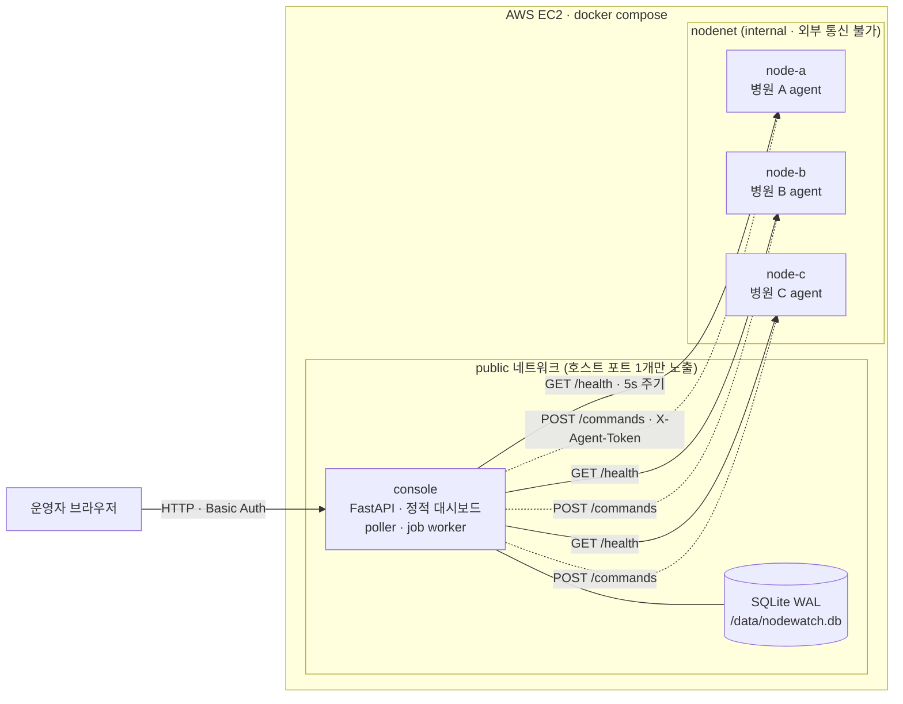
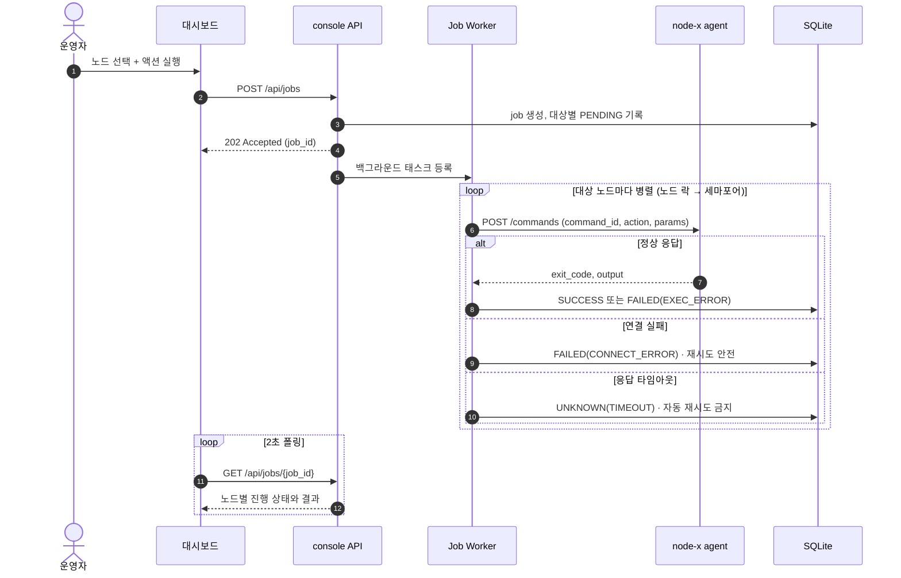

# NodeWatch

분산 온프레미스 노드(병원 A·B·C) 원격 헬스체크 · 일괄 점검 미니 플랫폼

| 항목 | 값 |
|---|---|
| **라이브 데모** | **http://TBD_EC2_PUBLIC_IP/** |
| **계정** | `admin` / `TBD_DEMO_PASSWORD` (브라우저 HTTP Basic 인증 창에 입력) |
| 운영 기간 | TBD ~ 평가 종료 시까지 |
| 로컬 실행 | `docker compose up -d --build` → http://localhost:8080 (`admin` / `nodewatch`) |

> 미기재 항목 확인: `grep -n TBD README.md history.md`

---

## 1. 개요

중앙 console이 병원별 agent에서 5초마다 상태를 수집해 정상/경고/장애로 판정하고, 운영자가 여러 노드를 골라 화이트리스트 운영 명령(로그 정리, 캐시 플러시, 데몬 재시작, 진단 수집)을 일괄 실행하면 비동기로 처리한 뒤 노드별 결과와 반환 로그를 기록한다.

핵심 설계 원칙은 세 가지다.

- **한 노드의 지연이 전체를 멈추지 않는다** — 노드별 병렬 호출, 호출마다 connect/read 타임아웃 분리.
- **모르는 것은 모른다고 기록한다** — 응답 타임아웃은 "실패"가 아니라 "결과 미확인(UNKNOWN)"이며 자동 재시도하지 않는다.
- **임의 명령은 존재하지 않는다** — 명령은 카탈로그에 등록된 액션과 검증된 파라미터로만 실행된다.

| 문서 | 내용 |
|---|---|
| `README.md` | 접속 정보, 아키텍처, 실행 방법, 설계 의도 (이 문서) |
| `docs/SPEC.md` | 상태 판정 규칙, 타임아웃 예산, API·스키마 등 구현 기준 명세 |
| `history.md` | AI 협업 방식과 엔지니어 개입·트러블슈팅 기록 |
| `CLAUDE.md` | 코드 생성 AI에게 준 작업 규칙 |

---

## 2. 평가자용 시연 시나리오 (약 3분)

기동 직후 세 노드가 서로 다른 상태로 보이도록 프로필을 설정해 두었다.

| 단계 | 조작 | 기대 결과 | 확인 포인트 |
|---|---|---|---|
| 1 | 대시보드 접속 → **상태 현황** | 병원 A 정상, 병원 B 경고(디스크), 병원 C 장애(`emr-sync` 중지) | 상태별 색·사유(reasons) 표기 |
| 2 | **일괄 제어** → 병원 C 선택 → 데몬 재시작(`emr-sync`) | 확인 모달 → job 생성 → 수 초 후 SUCCESS, 상태 현황에서 C가 정상 복귀 | 비동기 실행, 결과 기록 |
| 3 | **데모 제어** → 병원 C `blackhole` ON | 약 15초(3주기) 후 C만 "장애·통신두절". A/B의 "마지막 수집" 시각은 계속 5초 간격 갱신 | **비블로킹** |
| 4 | **일괄 제어** → 전체 선택 → 로그 정리 | 즉시 job 생성. A/B SUCCESS, C는 15초 후 UNKNOWN(결과 미확인) | 타임아웃 ≠ 실패 |
| 5 | **데모 제어** → C 초기화 → **실행 이력**에서 해당 job [결과 재확인] | C가 SUCCESS로 갱신 (blackhole 중에도 명령은 실제로 실행됐음) | reconcile, 멱등 설계 이유 |
| 6 | (선택) 서버에서 `docker compose stop node-c` 후 명령 실행 | C는 즉시 FAILED(CONNECT_ERROR, 미전달) | 미전달과 미확인의 구분 |

---

## 3. 아키텍처

### 3.1 구성도



| 구성 요소 | 책임 |
|---|---|
| console / poller | 5초 주기로 전 노드 병렬 수집, 노드별 연속 실패·지연 추적, 상태 판정 |
| console / job worker | 일괄 명령을 백그라운드로 노드별 병렬 실행 (노드별 직렬화 + 전역 동시성 상한), 결과 기록 |
| console / API + UI | REST API와 정적 대시보드를 같은 오리진에서 제공, HTTP Basic 인증 |
| agent (node-a/b/c) | 더미 메트릭·데몬 상태 시뮬레이션, 화이트리스트 명령 실행, 장애 주입(chaos) |
| SQLite | job 이력과 노드별 결과·반환 로그 영속화 (헬스 샘플은 메모리) |

### 3.2 일괄 명령 처리 흐름



---

## 4. 로컬 빌드 및 실행

요구 사항: Docker 24+ 와 Docker Compose v2.

```bash
git clone TBD_REPO_URL nodewatch
cd nodewatch
docker compose up -d --build
docker compose ps          # 4개 컨테이너 healthy 확인
```

- 접속: http://localhost:8080 — `admin` / `nodewatch`
- `.env` 없이 기본값으로 동작한다. 값을 바꾸려면 `cp .env.example .env` 후 수정.
- 종료: `docker compose down` (이력까지 삭제: `docker compose down -v`)

주요 설정 (전체 목록은 `docs/SPEC.md §2.2, §5`):

| 변수 | 기본값 | 설명 |
|---|---|---|
| `CONSOLE_PORT` | 8080 | 호스트 노출 포트 |
| `ADMIN_USER` / `ADMIN_PASSWORD` | admin / nodewatch | 대시보드 계정 |
| `AGENT_TOKEN_A/B/C` | dev-token-a/b/c | console ↔ agent 인증 토큰 |
| `POLL_INTERVAL_SEC` | 5 | 헬스체크 주기 |
| `HEALTH_CONNECT_TIMEOUT` / `HEALTH_READ_TIMEOUT` | 1.0 / 3.0 | 헬스체크 타임아웃(초) |
| `CMD_CONNECT_TIMEOUT` / `CMD_READ_TIMEOUT` | 2.0 / 15 | 명령 타임아웃(초) |
| `FAIL_THRESHOLD` | 3 | 연속 실패 n회부터 통신두절 판정 |

---

## 5. AWS 데모 환경

| 항목 | 값 |
|---|---|
| 인스턴스 | TBD (예: t3.micro, Amazon Linux 2023, ap-northeast-2) |
| 보안 그룹 인바운드 | 80/tcp 0.0.0.0/0 (데모), 22/tcp 관리자 IP만 |
| 노출 포트 | console 1개 (`CONSOLE_PORT=80`). agent 포트는 호스트에 바인딩하지 않음 |

배포 절차 (실제 수행한 명령으로 확정: TBD):

```bash
# Docker 설치 및 기동 (Amazon Linux 2023 기준)
sudo dnf install -y docker git
sudo systemctl enable --now docker
sudo usermod -aG docker ec2-user   # 재로그인 필요

# Compose v2 플러그인
sudo mkdir -p /usr/local/lib/docker/cli-plugins
sudo curl -SL https://github.com/docker/compose/releases/latest/download/docker-compose-linux-x86_64 \
  -o /usr/local/lib/docker/cli-plugins/docker-compose
sudo chmod +x /usr/local/lib/docker/cli-plugins/docker-compose

# 1GB 메모리 인스턴스: 이미지 빌드 중 OOM 방지용 swap
sudo dd if=/dev/zero of=/swapfile bs=1M count=1024
sudo chmod 600 /swapfile && sudo mkswap /swapfile && sudo swapon /swapfile

# 기동
git clone TBD_REPO_URL nodewatch && cd nodewatch
cat > .env <<'EOF'
CONSOLE_PORT=80
ADMIN_PASSWORD=TBD_DEMO_PASSWORD
AGENT_TOKEN_A=TBD
AGENT_TOKEN_B=TBD
AGENT_TOKEN_C=TBD
EOF
docker compose up -d --build
```

컨테이너는 `restart: unless-stopped`로 인스턴스 재부팅 후 자동 기동된다.

---

## 6. 설계 의도 — 온프레미스 원격 운영 관점

### 6.1 네트워크는 실패한다는 전제

병원 전산실은 회선 품질, 방화벽 정책, 장비 상태가 제각각이다. 그래서 모든 원격 호출을 "실패할 수 있는 호출"로 설계했다.

- 호출마다 connect 타임아웃과 read 타임아웃을 분리했다. 연결이 1초 안에 안 되면 경로 문제로 보고 즉시 포기하고, 연결된 뒤에는 작업 성격에 맞는 시간(헬스 3초, 명령 15초)을 기다린다.
- 헬스체크는 전 노드를 병렬로 호출하므로 한 사이클의 소요 시간은 노드 수의 합이 아니라 가장 느린 노드 하나로 제한된다. connect+read(4초)가 주기(5초)보다 짧아 사이클이 겹치지 않고, 그래도 겹치면 해당 노드만 이번 주기를 건너뛴다.
- 노드 수가 수백 개로 늘어나도 console 자원이 고갈되지 않도록 동시 호출 수에 상한을 두었다.

### 6.2 오탐 억제

한 번의 타임아웃으로 "장애"를 띄우면 운영자는 곧 경보를 무시하게 된다. 1~2회 실패는 "경고 + 수집 실패 n회"로, 3회 연속 실패부터 "장애·통신두절"로 판정한다. 모든 판정에는 사유(reasons)를 붙여 화면만 보고 원인을 알 수 있게 했고, 수집 실패 중에는 마지막 성공 값이 오래된 값임을 표시한다.

### 6.3 비동기 제어

일괄 명령 API는 job을 기록한 즉시 202와 job_id를 돌려주고 실행은 백그라운드에서 진행한다. 브라우저를 닫아도 실행은 계속되고 결과는 DB에 남는다. 같은 노드에 대한 명령은 순서대로 하나씩 실행해 데몬 재시작이 겹치는 상황을 막았다.

### 6.4 "실패"와 "결과 미확인"의 구분

원격 운영에서 가장 위험한 순간은 명령을 보냈는데 응답이 오지 않을 때다. 이때 자동 재시도를 하면 데몬 재시작 같은 명령이 두 번 실행될 수 있다.

- 연결 자체가 안 된 경우(요청 미전달)는 FAILED로 기록하고 재시도 안전으로 표시한다.
- 연결 후 응답이 없는 경우는 UNKNOWN으로 기록하고 자동 재시도하지 않는다.
- 모든 명령에 `command_id`를 붙이고 agent는 같은 ID를 재실행하지 않는다. 운영자는 [결과 재확인]으로 agent에 실제 결과를 다시 물어볼 수 있다.
- console이 재기동되면 전송 전(PENDING)이던 대상은 FAILED, 전송 후(RUNNING)였을 수 있는 대상은 UNKNOWN으로 정리한다.

### 6.5 보안

- 대시보드와 API는 임의 명령 문자열을 받지 않는다. 명령은 카탈로그의 액션과 enum 파라미터로만 표현되며 console과 agent가 이중으로 검증한다.
- console ↔ agent는 노드별 토큰으로 인증하고, agent 포트는 외부에 노출하지 않는다 (`nodenet` internal 네트워크).
- 요청자와 실행 결과를 모두 기록하고, 노드가 돌려주는 출력은 64KB로 잘라 저장한다.

### 6.6 폐쇄망 친화

프론트엔드는 빌드 단계와 외부 CDN 없이 정적 파일 3개로 구성했다. 인터넷이 차단된 병원망에서도 이미지만 반입하면 그대로 동작한다. 외부 SaaS 의존도 없다.

### 6.7 실환경 적용 시 달라질 점

이 프로토타입은 console이 agent를 호출하는 **Pull 모델**이다. 타임아웃과 비블로킹 동작을 명확히 보여주기 위해 선택했다. 실제 병원망은 대개 외부에서 들어오는 연결(inbound)을 막기 때문에 운영 환경에서는 agent가 console로 먼저 연결하는 **발신형 모델**(heartbeat push + 명령 long-poll/WebSocket 수신)이 적합하다. 호출부를 `agent_client.py` 한 곳에 모아 두어 전송 방식만 교체할 수 있게 했다.

---

## 7. 에러 핸들링 전략

| 상황 | 감지 | 처리 | 화면 표시 | 재시도 |
|---|---|---|---|---|
| 노드 다운 (연결 거부) | `ConnectError` | 즉시 실패 기록 | 헬스: 수집 실패 n회 → 통신두절 / 명령: FAILED(CONNECT_ERROR) | 헬스: 다음 주기 / 명령: 수동, 안전 |
| 연결 지연 | `ConnectTimeout` (1~2s) | 즉시 포기 | 위와 동일 | 위와 동일 |
| 응답 지연·무응답 | `ReadTimeout` (3s / 15s) | 해당 노드만 중단, 타 노드 무영향 | 헬스: 수집 실패 / 명령: UNKNOWN(TIMEOUT) | 명령 자동 재시도 금지 → 결과 재확인 |
| agent 오류 | HTTP 4xx/5xx | 오류 코드·메시지 기록 | FAILED(AGENT_ERROR) | 수동 |
| 명령 실행 실패 | `exit_code ≠ 0` | 출력과 함께 기록 | FAILED(EXEC_ERROR) | 수동 |
| 응답 형식 이상 | 스키마 검증 실패 | 원문 일부 기록 | 헬스: 수집 실패 / 명령: UNKNOWN | 결과 재확인 |
| 수집 사이클 겹침 | 노드별 in-flight 플래그 | 해당 노드만 이번 주기 건너뜀 | `skipped_cycles` 카운트 | 다음 주기 |
| poller 내부 예외 | 루프 레벨 예외 처리 | 로그 후 루프 유지 | 수집 지연 시 전체 stale 표시 | 자동 |
| console 재기동 | 기동 시 RUNNING job 조회 | INTERRUPTED 처리 | PENDING→FAILED, RUNNING→UNKNOWN | 결과 재확인 / 재실행 |
| console 자체 접속 불가 | 대시보드 fetch 실패 | 기존 값 유지 + 흐림 처리 | "콘솔 연결 끊김 — 마지막 갱신 시각" 배너 | 자동 폴링 |
| 과대 출력 | 크기 검사 | 64KB 절단 | "출력 일부 생략" 표시 | — |

세부 기준은 `docs/SPEC.md §4~§6` 참고.

---

## 8. 프로젝트 구조

```
.
├── docker-compose.yml
├── .env.example
├── console/          # 중앙 API · poller · job worker · 정적 대시보드
│   ├── app/
│   ├── nodes.json    # 노드 레지스트리 (토큰은 env 참조)
│   └── tests/
├── agent/            # 병원 노드 mock agent (node-a/b/c 공용 이미지)
│   └── app/
└── docs/
    └── SPEC.md
```

---

## 9. 한계와 향후 과제

| 항목 | 현재 | 운영 적용 시 |
|---|---|---|
| 통신 방향 | console → agent (Pull) | agent 발신형 연결, 중계 서버 |
| 전송 보안 | HTTP + 노드별 토큰 | TLS/mTLS, 토큰 로테이션 |
| 권한 | 단일 관리자 계정 | 조회/실행 권한 분리, HIGH 위험도 2인 승인 |
| 대규모 실행 | 전역 동시성 상한 | canary 1대 → 나머지 순차 롤아웃, 점검 시간대 예약 |
| 결과 재확인 | 수동 | 일정 시간 후 자동 reconcile |
| 이력·지표 | SQLite, 메모리 샘플 | 시계열 DB, 알림 연계 |
| 가용성 | console 단일 인스턴스 | 상태 외부화 후 다중화 |
